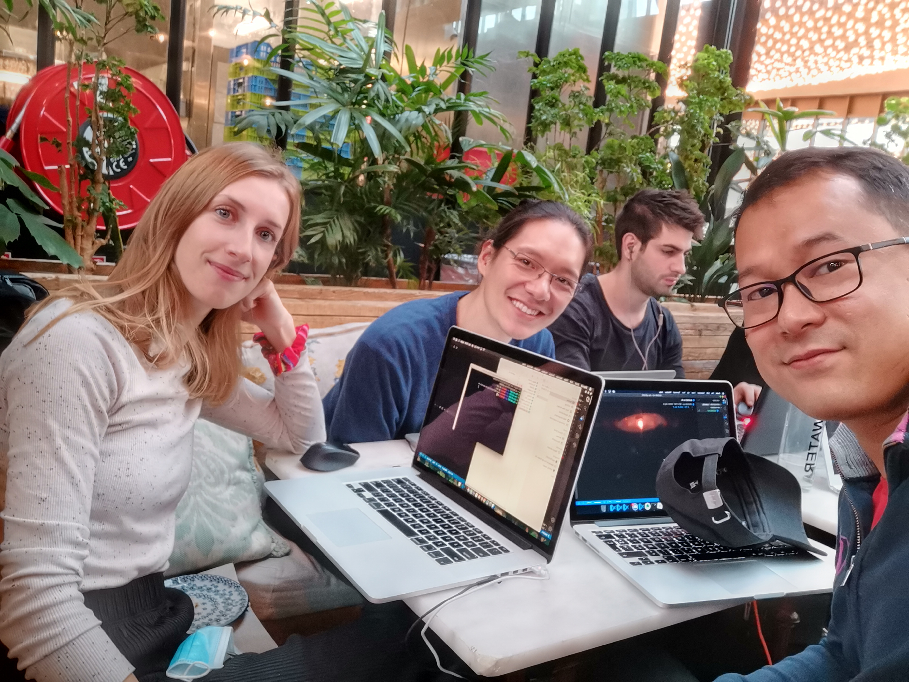

# THP - WEEK 2 day 2 

## Learn Ruby by pair programming 
Hello welcome to our project 

We practice exercices by pair programming to learn ruby efficiently.

## Contributors  
- [Marie DECHAUX](https://github.com/mariedx) 
- [Maxime WONG](https://github.com/Mtwod)
- [Vanak LAY](https://github.com/vanaklay)